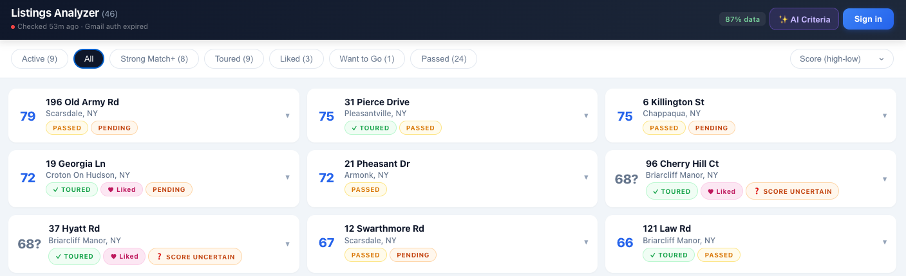

# Listings Analyzer

An AI-powered real estate dashboard. It reads your Gmail listing alerts, pulls out the details, and scores every property against your personal criteria — so you can focus on the good ones instead of wading through email.



---

## 🤖 New to coding? Let an AI walk you through setup

Copy this entire README and paste it into [Claude](https://claude.ai) or [ChatGPT](https://chatgpt.com), then say:

> *"Help me set up this app step by step. I'm not a developer — walk me through every command."*

The AI will guide you interactively, explain each step, and answer questions as you go.

---

## How It Works

1. **Reads your Gmail** — polls listing alert emails from Redfin, OneKey MLS, or any agent forwarding you links
2. **Extracts listing data** — address, price, beds, baths, sqft, year built
3. **Enriches listings** — school ratings and commute time to your office
4. **Scores with AI** — Claude evaluates each listing against criteria *you* define
5. **Shows a dashboard** — mobile-friendly, filterable, shareable links per category

## Prerequisites

You'll need these before starting:

| Tool | Purpose | Install |
|------|---------|---------|
| Python 3.12+ | Run the app | [python.org](https://www.python.org/downloads/) |
| `uv` | Package manager | `curl -LsSf https://astral.sh/uv/install.sh \| sh` |
| Fly.io CLI | Deploy to the web | [fly.io/docs/flyctl/install](https://fly.io/docs/flyctl/install/) |
| Gmail account | Source of listing alerts | Your existing Google account |
| Anthropic API key | AI scoring | [console.anthropic.com](https://console.anthropic.com) |

---

## Setup

### Step 1 — Get the code

```bash
git clone https://github.com/Akibalogh/listings-analyzer.git
cd listings-analyzer
uv sync
```

### Step 2 — Create your config file

```bash
cp .env.example .env
```

Open `.env` in any text editor. You'll fill in the values in the steps below.

### Step 3 — Get an Anthropic API key

1. Sign up at [console.anthropic.com](https://console.anthropic.com)
2. Go to **API Keys → Create Key**
3. Paste it into `.env` as `ANTHROPIC_API_KEY=sk-ant-...`

### Step 4 — Set up Gmail access

This lets the app read your listing alert emails. It never sends email or touches anything else.

**4a. Create a Google Cloud project:**

1. Go to [console.cloud.google.com](https://console.cloud.google.com)
2. Click the project dropdown → **New Project** (any name, e.g. "listings-analyzer")
3. Search "Gmail API" in the search bar → click it → **Enable**
4. Go to **APIs & Services → Credentials → + Create Credentials → OAuth client ID**
5. Application type: **Desktop app** → Create
6. Click the download icon (⬇) to save the JSON file

**4b. Put the credentials in your `.env`:**

Open the downloaded JSON file. Copy the entire contents and paste them as the value of `GMAIL_CREDENTIALS_JSON` in your `.env`:

```
GMAIL_CREDENTIALS_JSON={"installed":{"client_id":"...","client_secret":"...",...}}
```

**4c. Authorize and get a refresh token:**

```bash
uv run python scripts/gmail_auth.py
```

A browser window will open — sign in with your Gmail account and click Allow. When it finishes, it will print a refresh token. Copy that into your `.env`:

```
GMAIL_REFRESH_TOKEN=1//...
```

### Step 5 — Configure who can log in and what to watch

Add these to your `.env`:

```bash
# Your Google email address (who can access the dashboard)
ALLOWED_EMAILS=you@gmail.com

# Which senders to watch for listing alerts
# Use a domain like "redfin.com" to catch all Redfin alerts
ALERT_SENDERS=redfin.com,youragent@example.com
```

### Step 6 — Run it locally

```bash
uv run uvicorn app.main:app --reload --port 8000
```

Open [http://localhost:8000](http://localhost:8000) in your browser and sign in with your Google account.

### Step 7 — Set your search criteria

On first run the dashboard is empty. Click **✨ AI Criteria** and describe what you're looking for — price range, size, location, must-haves, deal-breakers. The AI will score all your listings against this.

Then click **Poll** to trigger your first email fetch, or wait — it auto-polls every hour.

---

## Optional Enrichment

These are extras — skip them to start, add later if you want the data.

| Feature | How to get it | What to set |
|---------|--------------|-------------|
| School ratings | Free at [developer.schooldigger.com](https://www.developer.schooldigger.com) | `SCHOOLDIGGER_APP_ID` + `SCHOOLDIGGER_APP_KEY` |
| Commute times | Google Maps API key ([console.cloud.google.com](https://console.cloud.google.com)) | `GOOGLE_MAPS_API_KEY` + `COMMUTE_DESTINATION` |

---

## Deploy to the Web (Fly.io)

Running on Fly.io means the app polls email 24/7, even when your laptop is off.

```bash
# First time — creates your app
fly launch

# Set your secrets
fly secrets set GMAIL_CREDENTIALS_JSON='{"installed":{...}}'
fly secrets set GMAIL_REFRESH_TOKEN='1//...'
fly secrets set ANTHROPIC_API_KEY='sk-ant-...'
fly secrets set ALLOWED_EMAILS='you@gmail.com'
fly secrets set ALERT_SENDERS='redfin.com'
fly secrets set MANAGE_KEY='any-random-string-you-make-up'

# Deploy
fly deploy
```

Your app will be live at `https://your-app-name.fly.dev`.

---

## Dashboard Filters

| View | Shows |
|------|-------|
| All | Every listing |
| Non-Reject | Anything not scored as reject |
| Strong Match | High AI score |
| Worth Touring | Good candidates |
| Toured | Properties you've visited |
| Want to Go | Flagged for tour scheduling |

All filter views have shareable URLs — send the link to your partner or agent.

---

## Project Structure

```
app/
├── main.py          # API endpoints + scheduler
├── scorer.py        # AI evaluation (Claude Haiku)
├── gmail.py         # Gmail polling
├── enrichment.py    # School ratings + commute times
├── parsers/         # Email parsers (Redfin, OneHome, LLM fallback)
└── templates/
    └── dashboard.html
tests/               # 280+ tests
scripts/
└── gmail_auth.py    # Gmail OAuth setup helper
```

---

## License

MIT
